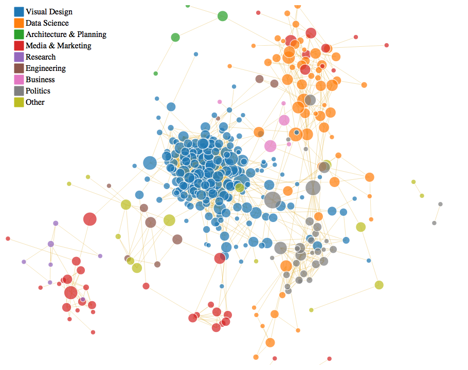

<!-- README.md is generated from README.Rmd. Please edit that file -->
### Visualize Your LinkedIn Network

This repository is a tutorial demonstrating how to use your LinkedIn data to visualize your professional-social network in R and D3.JS.

``` r

#####
# Install and Load Libraries
#####

library("networkD3")
library("rjson")
library("jsonlite")
#> 
#> Attaching package: 'jsonlite'
#> The following objects are masked from 'package:rjson':
#> 
#>     fromJSON, toJSON
library("igraph") 
#> 
#> Attaching package: 'igraph'
#> The following objects are masked from 'package:stats':
#> 
#>     decompose, spectrum
#> The following object is masked from 'package:base':
#> 
#>     union

l <- fromJSON("https://raw.githubusercontent.com/michaeljules/social-network-viz/master/data/data.js",flatten=TRUE)

#######
# Translate Data to Network Object
#######

networkData <- l$reducedMatrix
rownames(networkData) <- paste0(l$publicConnections$firstName[1:499]," ",l$publicConnections$lastName[1:499])
colnames(networkData) <- rownames(networkData) 

g <- graph.adjacency(networkData,mode="undirected")
class(g)
#> [1] "igraph"

# Add attributes to the network, vertices, or edges:
V(g)$industry <- l$publicConnections$industry[1:499]
V(g)$location <- l$publicConnections$location.name[1:499]
V(g)$names <- paste0(l$publicConnections$firstName[1:499]," ",l$publicConnections$lastName[1:499])
V(g)$click <- l$publicConnections$pictureUrl[1:499]
V(g)$country <- l$publicConnections$location.country.code[1:499]
V(g)$headline <- l$publicConnections$headline[1:499]

#######
# Create Node Dataset
#######

nodes <- as.data.frame(cbind(paste0(l$publicConnections$firstName[1:499]," ",l$publicConnections$lastName[1:499]),l$publicConnections$industry[1:499],l$publicConnections$location.name[1:499],l$publicConnections$pictureUrl[1:499],l$publicConnections$location.country.code[1:499]))
colnames(nodes) <- c("name","industry","location","click","country")

#######
# Create Links Dataset
#######
links <- as.data.frame(get.edgelist(g))
colnames(links) <- c("source","target")

#######
# Calculate Network Centrality
#######

b <- betweenness(g, v=V(g), directed = FALSE, weights = NULL,
                 nobigint = TRUE, normalized = FALSE)
V(g)$betweenness <- sqrt(b)

########
# Remove Isolates
#######

#identify isolated nodes
bad.vs <- V(g)[degree(g) == 0] 

# remove isolated nodes
g <- delete.vertices(g, bad.vs)

#######
# Calculate Neighborhood Clusters
######

# The neighborhood of a given order o of a vertex v includes all vertices which are closer to v than the order. Ie. order 0 is always v itself, order 1 is v plus its immediate neighbors, order 2 is order 1 plus the immediate neighbors of the vertices in order 1, etc.

c3 <- cluster_label_prop(g)
V(g)$c3 <- c3$membership

# Label Group Memberships
c3$group <- c3$membership
#c3$group <- "Misc"
c3$group[c3$membership==1] <- "Visual Design"
c3$group[c3$membership==2] <- "Data Science"
c3$group[c3$membership==3] <- "Architecture & Planning"
c3$group[c3$membership==4] <- "Media & Marketing"
c3$group[c3$membership==5] <- "Media & Marketing"
c3$group[c3$membership==6] <- "Research"
c3$group[c3$membership==7] <- "Engineering"
c3$group[c3$membership==8] <- "Media & Marketing"
c3$group[c3$membership==9] <- "Business"
c3$group[c3$membership==10] <- "Politics"
c3$group[c3$membership==11] <- "Media & Marketing"
c3$group[c3$membership==12] <- "Data Science"
c3$group[c3$membership==13] <- "Data Science"
c3$group[c3$membership==14] <- "Other"
c3$group[c3$membership==15] <- "Other"
c3$group[c3$membership==16] <- "Other"
c3$group[c3$membership==17] <- "Data Science"
c3$group[c3$membership==18] <- "Other"
c3$group[c3$membership==19] <- "Engineering"
c3$group[c3$membership==20] <- "Politics"
c3$group[c3$membership==21] <- "Media & Marketing"

V(g)$c3 <- c3$group

library(networkD3)
# Translate to iGraph to D3
g_d3 <- igraph_to_networkD3(g)

## Add Attributes
g_d3$nodes$location <- V(g)$location
g_d3$nodes$industry <- V(g)$industry
g_d3$nodes$click    <- V(g)$click
g_d3$nodes$betweenness  <- V(g)$betweenness
g_d3$nodes$country <- V(g)$country
g_d3$nodes$position <- V(g)$position
g_d3$nodes$group <- V(g)$neighborhood
g_d3$nodes$headline <- V(g)$headline
g_d3$nodes$cle <- V(g)$cle
g_d3$nodes$c3 <- V(g)$c3

net <- forceNetwork(Links=g_d3$links,
             Nodes=g_d3$nodes,
             width=960,
             height=700,
             NodeID = 'headline', 
             Group  = 'c3',
             radiusCalculation = JS("Math.sqrt(d.nodesize)+5"),
             Nodesize = 'betweenness',
             charge = -60,
             linkWidth = .4,
             colourScale = JS("d3.scale.category10()"),
             linkColour = "goldenrod",
             zoom = FALSE,
             legend = TRUE,
             opacity = .85,
             opacityNoHover = 0,
             bounded = FALSE,
             fontFamily = "San Francisco",
             fontSize = 14) 
```

Example
-------


