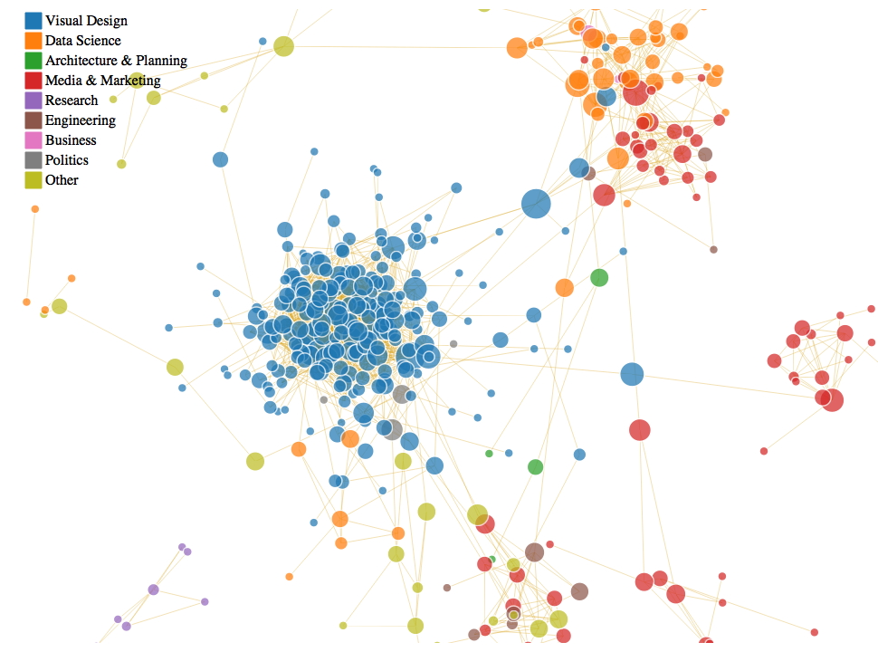

<!-- README.md is generated from README.Rmd. Please edit that file -->
<a href="https://d3js.org"></a>

<iframe src="https://raw.githubusercontent.com/michaeljules/social-network-viz/master/html/linkedin-network-viz.html">
</iframe>
``` r

#####
# Install and Load Libraries
#####

library("networkD3")
library("rjson")
library("jsonlite")
#> 
#> Attaching package: 'jsonlite'
#> The following objects are masked from 'package:rjson':
#> 
#>     fromJSON, toJSON
library("igraph") 
#> 
#> Attaching package: 'igraph'
#> The following objects are masked from 'package:stats':
#> 
#>     decompose, spectrum
#> The following object is masked from 'package:base':
#> 
#>     union

l <- fromJSON("https://raw.githubusercontent.com/michaeljules/social-network-viz/master/data/data.js",flatten=TRUE)

#######
# Translate Data to Network Object
#######

networkData <- l$reducedMatrix
rownames(networkData) <- paste0(l$publicConnections$firstName[1:499]," ",l$publicConnections$lastName[1:499])
colnames(networkData) <- rownames(networkData) 

g <- graph.adjacency(networkData,mode="undirected")
class(g)
#> [1] "igraph"

# Add attributes to the network, vertices, or edges:
V(g)$industry <- l$publicConnections$industry[1:499]
table(V(g)$industry)
#> 
#>                           Accounting                            Animation 
#>                                    4                                    3 
#>                  Apparel and Fashion            Architecture and Planning 
#>                                    1                                    3 
#>                           Automotive                              Banking 
#>                                    2                                    4 
#>                        Biotechnology                      Broadcast Media 
#>                                    3                                    2 
#>                   Building Materials                       Computer Games 
#>                                    1                                    4 
#>                    Computer Software                         Construction 
#>                                   44                                    1 
#>                    Consumer Services                            Cosmetics 
#>                                    3                                    2 
#>                               Design                 Education Management 
#>                                   13                                    4 
#>                        Entertainment               Environmental Services 
#>                                    6                                    2 
#>                      Events Services                     Executive Office 
#>                                    2                                    1 
#>                   Financial Services                   Food and Beverages 
#>                                   14                                    1 
#>                 Gambling and Casinos            Government Administration 
#>                                    1                                    4 
#>                 Government Relations                       Graphic Design 
#>                                    1                                    6 
#>         Health, Wellness and Fitness                     Higher Education 
#>                                    2                                   12 
#>             Hospital and Health Care                      Human Resources 
#>                                    6                                   12 
#>                 Information Services  Information Technology and Services 
#>                                    6                                   79 
#>                            Insurance                International Affairs 
#>                                    4                                    1 
#>  International Trade and Development                             Internet 
#>                                    2                                   21 
#>                Investment Management                         Law Practice 
#>                                    1                                    7 
#>                       Legal Services                   Legislative Office 
#>                                    4                                    2 
#>           Logistics and Supply Chain                Management Consulting 
#>                                    1                                   14 
#>                      Market Research            Marketing and Advertising 
#>                                    9                                   19 
#> Mechanical or Industrial Engineering                     Media Production 
#>                                    1                                    3 
#>                       Medical Device                     Medical Practice 
#>                                    2                                    1 
#>             Motion Pictures and Film                                Music 
#>                                    6                                    1 
#>   Non-profit Organization Management                       Oil and Energy 
#>                                    7                                    7 
#>                    Online Publishing                      Performing Arts 
#>                                    4                                    1 
#>                      Pharmaceuticals                             Plastics 
#>                                    2                                    1 
#>               Political Organization                             Printing 
#>                                    5                                    2 
#>                Professional Training                  Program Development 
#>                                    1                                    1 
#>                        Public Policy                     Public Relations 
#>                                    1                                    4 
#>                          Real estate           Renewables and Environment 
#>                                    7                                    1 
#>                             Research                               Retail 
#>                                   63                                    4 
#>                       Semiconductors                               Sports 
#>                                    1                                    1 
#>              Staffing and Recruiting                   Telecommunications 
#>                                   23                                    6 
#>                          Think Tanks                      Venture Capital 
#>                                    1                                    1 
#>                  Writing and Editing 
#>                                    1
V(g)$location <- l$publicConnections$location.name[1:499]
table(V(g)$location)
#> 
#>                         Ahmedabad Area, India 
#>                                             1 
#>                  Allentown, Pennsylvania Area 
#>                                             1 
#>                          Amarillo, Texas Area 
#>                                             1 
#>                   Amsterdam Area, Netherlands 
#>                                             1 
#>                            Austin, Texas Area 
#>                                            56 
#>                                     Australia 
#>                                             1 
#>                      Be’er Sheva Area, Israel 
#>                                             1 
#>                                       Belarus 
#>                                             1 
#>                   Belo Horizonte Area, Brazil 
#>                                             1 
#>                         Bengaluru Area, India 
#>                                             7 
#>                      Birmingham, Alabama Area 
#>                                             1 
#>                   Bismarck, North Dakota Area 
#>                                             1 
#>                             Boise, Idaho Area 
#>                                             1 
#>                                        Brazil 
#>                                             1 
#>                                      Cambodia 
#>                                             1 
#>               Charleston, South Carolina Area 
#>                                             1 
#>                                         Chile 
#>                                             1 
#>                           Cincinnati Area, KY 
#>                                             2 
#>                                      Colombia 
#>                                             1 
#>                              Como Area, Italy 
#>                                             1 
#>                    Corpus Christi, Texas Area 
#>                                             1 
#>                                       Croatia 
#>                                             1 
#>                        Dallas/Fort Worth Area 
#>                                            16 
#>                           El Paso, Texas Area 
#>                                             1 
#>                                       Finland 
#>                                             1 
#>               Frankfurt Am Main Area, Germany 
#>                                             1 
#>                                     Gibraltar 
#>                                             1 
#>                          Greater Atlanta Area 
#>                                             2 
#>                           Greater Boston Area 
#>                                            12 
#>                          Greater Chicago Area 
#>                                            10 
#>                           Greater Denver Area 
#>                                             3 
#>                          Greater Detroit Area 
#>                                             3 
#>                      Greater Los Angeles Area 
#>                                            96 
#>             Greater Minneapolis-St. Paul Area 
#>                                             1 
#>                    Greater Nashville Area, TN 
#>                                             1 
#>                      Greater New Orleans Area 
#>                                             3 
#>                    Greater New York City Area 
#>                                            41 
#>                            Greater Omaha Area 
#>                                             1 
#>                     Greater Philadelphia Area 
#>                                             2 
#>                       Greater Pittsburgh Area 
#>                                             1 
#>                   Greater Salt Lake City Area 
#>                                             3 
#>                        Greater San Diego Area 
#>                                             9 
#>                          Greater Seattle Area 
#>                                            10 
#>                        Greater St. Louis Area 
#>                                             1 
#> Greensboro/Winston-Salem, North Carolina Area 
#>                                             1 
#>                        Guadalupe Area, Mexico 
#>                                             1 
#>                                Gurgaon, India 
#>                                             1 
#>                    Hartford, Connecticut Area 
#>                                             1 
#>                              Hawaiian Islands 
#>                                             1 
#>                                     Hong Kong 
#>                                             1 
#>                           Houston, Texas Area 
#>                                            17 
#>                         Hyderabad Area, India 
#>                                             2 
#>                                         India 
#>                                             1 
#>                                       Ireland 
#>                                             1 
#>                                        Israel 
#>                                             1 
#>                                         Italy 
#>                                             1 
#>                    Jacksonville, Florida Area 
#>                                             1 
#>               Johannesburg Area, South Africa 
#>                                             1 
#>                    Killeen/Temple, Texas Area 
#>                                             1 
#>                     Knoxville, Tennessee Area 
#>                                             2 
#>                                        Kosovo 
#>                                             1 
#>                       Lafayette, Indiana Area 
#>                                             1 
#>                        Las Vegas, Nevada Area 
#>                                             1 
#>                        London, United Kingdom 
#>                                             8 
#>                       Madison, Wisconsin Area 
#>                                             2 
#>                            Málaga Area, Spain 
#>                                             1 
#>                        Marseille Area, France 
#>                                             1 
#>                          Melbourne, Australia 
#>                                             1 
#>                    Miami/Fort Lauderdale Area 
#>                                             1 
#>                      Montpellier Area, France 
#>                                             1 
#>                            Mumbai Area, India 
#>                                             1 
#>                         New Delhi Area, India 
#>                                             3 
#>                             Noida Area, India 
#>                                             2 
#>                    Nottingham, United Kingdom 
#>                                             1 
#>                    Odessa/Midland, Texas Area 
#>                                             1 
#>                               Ontario, Canada 
#>                                             1 
#>                Orange County, California Area 
#>                                             8 
#>                         Orlando, Florida Area 
#>                                             2 
#>                                      Pakistan 
#>                                             1 
#>                            Paris Area, France 
#>                                             2 
#>                              Perth, Australia 
#>                                             2 
#>                         Phoenix, Arizona Area 
#>                                             2 
#>                         Pocatello, Idaho Area 
#>                                             1 
#>                         Portland, Oregon Area 
#>                                             4 
#>                       Preston, United Kingdom 
#>                                             1 
#>                                Quebec, Canada 
#>                                             1 
#>           Raleigh-Durham, North Carolina Area 
#>                                             3 
#>                       Richmond, Virginia Area 
#>                                             2 
#>                      Rochester, New York Area 
#>                                             1 
#>                            Rouen Area, France 
#>                                             1 
#>                   Sacramento, California Area 
#>                                             1 
#>                       San Antonio, Texas Area 
#>                                             4 
#>                        San Francisco Bay Area 
#>                                            61 
#>                                        Serbia 
#>                                             1 
#>                                     Singapore 
#>                                             6 
#>                      South Bend, Indiana Area 
#>                                             1 
#>                             Sultanate of Oman 
#>                                             1 
#>                             Sydney, Australia 
#>                                             4 
#>                       Syracuse, New York Area 
#>                                             1 
#>                          Toronto, Canada Area 
#>                                             1 
#>                         Toulouse Area, France 
#>                                             1 
#>                          Tucson, Arizona Area 
#>                                             1 
#>                                       Tunisia 
#>                                             1 
#>                    Twickenham, United Kingdom 
#>                                             1 
#>                                       Ukraine 
#>                                             1 
#>                          United Arab Emirates 
#>                                             1 
#>                                United Kingdom 
#>                                             2 
#>                                 United States 
#>                                             1 
#>             Vanderbijlpark Area, South Africa 
#>                                             1 
#>                              Waco, Texas Area 
#>                                             1 
#>                    Washington D.C. Metro Area 
#>                                            10 
#>                 Within 23 wards, Tokyo, Japan 
#>                                             1 
#>                      Zürich Area, Switzerland 
#>                                             1
V(g)$names <- paste0(l$publicConnections$firstName[1:499]," ",l$publicConnections$lastName[1:499])
V(g)$click <- l$publicConnections$pictureUrl[1:499]
V(g)$country <- l$publicConnections$location.country.code[1:499]
V(g)$headline <- l$publicConnections$headline[1:499]

#######
# Create Node Dataset
#######

nodes <- as.data.frame(cbind(paste0(l$publicConnections$firstName[1:499]," ",l$publicConnections$lastName[1:499]),l$publicConnections$industry[1:499],l$publicConnections$location.name[1:499],l$publicConnections$pictureUrl[1:499],l$publicConnections$location.country.code[1:499]))
colnames(nodes) <- c("name","industry","location","click","country")

#######
# Create Links Dataset
#######
links <- as.data.frame(get.edgelist(g))
colnames(links) <- c("source","target")

#######
# Calculate Network Centrality
#######

b <- betweenness(g, v=V(g), directed = FALSE, weights = NULL,
                 nobigint = TRUE, normalized = FALSE)
V(g)$betweenness <- sqrt(b)
V(g)$betweenness
#>   [1]   0.0000000   0.0000000   0.0000000  35.4000503  11.7955165
#>   [6]  54.6559371   0.0000000   0.0000000  15.1953535  31.8211329
#>  [11]   0.0000000  19.2353841  37.2107395   0.0000000   5.9606065
#>  [16]   0.0000000   1.5758596   0.0000000   0.0000000   0.0000000
#>  [21]   0.0000000  85.6739822   3.3651146  14.6432393   0.0000000
#>  [26]  34.6822188  62.5396582   7.7561354   0.0000000   1.9257033
#>  [31]  11.3003214  12.9490583   0.0000000   0.0000000   4.7402254
#>  [36]   0.0000000  20.2521238   0.0000000  38.3144881   0.0000000
#>  [41]  58.5670245  33.3798637   0.0000000   0.0000000  52.5606391
#>  [46]   0.0000000  23.5102814   0.0000000  16.5628931  11.0850151
#>  [51]  37.2637336   0.0000000  15.6316027   0.0000000  17.2848639
#>  [56]   0.0000000  84.9020271   0.0000000  12.4383250   1.8929694
#>  [61]  19.4394665  11.4030761   0.0000000   2.5495098   0.0000000
#>  [66]  15.4214972   5.7328793   9.1740653   1.7197053   5.8935048
#>  [71]   0.0000000  19.2353841  51.1022785  23.4481467   0.7071068
#>  [76]   0.0000000   0.0000000   0.0000000   0.0000000   0.0000000
#>  [81]  15.5973513  16.7869389  17.0846261   0.0000000   0.0000000
#>  [86]   7.3788991  30.6020018   0.0000000  72.6610395   0.0000000
#>  [91]   3.6083147   1.9239847   0.0000000   7.9203184  38.5393798
#>  [96]  26.1928397   0.0000000   1.0000000   0.0000000   0.0000000
#> [101]   0.0000000   0.0000000  12.5077100   0.0000000   0.0000000
#> [106]   0.0000000   1.1233639   3.3753307  12.7514757  56.3295486
#> [111]  19.2353841   2.2022112   0.0000000   3.0648866  58.8702681
#> [116]   7.9940725   0.0000000   1.5659986   0.0000000   0.0000000
#> [121]  13.6094330   0.0000000   3.7688940  33.2565783   0.0000000
#> [126]   0.0000000   0.0000000   3.3911650  57.0788928  17.7374369
#> [131]  15.5790940   1.8022129  43.0740490   0.0000000  10.0595908
#> [136]   0.0000000  17.7502383 141.1803299  22.7324519   0.0000000
#> [141]   5.0991774   0.0000000  19.2873015   0.0000000  19.4325699
#> [146]   0.0000000   2.3407436   8.7581708   0.0000000  11.3969590
#> [151]   0.0000000   0.8099757  43.4864078  10.0188032   2.9183186
#> [156]  30.3232514  27.1719040   0.0000000   5.9069375  13.2177043
#> [161]   0.0000000  19.2527054   0.0000000  51.9794353  20.0214104
#> [166]  19.2353841   0.0000000   2.8424985   1.8484228  31.2742825
#> [171]   6.7990356   4.7565006  32.8935994   0.0000000   2.1515400
#> [176]  13.5517527   1.1979483   4.3086843   5.3040865   0.0000000
#> [181]  17.6903927  14.6063246   1.0265497  29.8766129  10.1477394
#> [186]   4.8098775   0.0000000  31.8511928   0.0000000   0.0000000
#> [191]   0.0000000  40.3235531   9.9062498   0.0000000  22.2184082
#> [196]  23.4170573   0.0000000   0.0000000  29.8402748  42.4490655
#> [201]  42.6307490   0.0000000   7.5279900  75.3657747   4.4362269
#> [206]  21.8707934  18.6276909   0.0000000   6.3935946  73.4785683
#> [211]   0.0000000  38.3029906   0.0000000  13.3835128  20.4557084
#> [216]   0.0000000  14.5988728   0.0000000  58.0195852  27.1661554
#> [221]   0.0000000 105.4776197  53.1833997  24.3561250   0.0000000
#> [226]  33.2056924  25.0926924   3.7935932  26.1278907   0.0000000
#> [231]   0.0000000   0.0000000   0.0000000  13.5830777   0.0000000
#> [236]   0.0000000   5.6356628  19.4824598   0.0000000  11.3746592
#> [241]   0.0000000   1.7828157  10.8736235   0.0000000  22.5280379
#> [246]  55.6386204  20.6177513   2.5430011   0.0000000  12.5766593
#> [251]   0.0000000  20.9678922  75.8477137   5.8898106   0.0000000
#> [256]   0.0000000   0.0000000   6.2222742  23.5379739  31.5102761
#> [261]  12.9605653  31.3742574   0.0000000  15.8656501  33.2264955
#> [266]   0.0000000   0.0000000   0.0000000   5.4870720  19.4331672
#> [271]  13.4746676  20.4969586   0.0000000   0.0000000  11.1360223
#> [276]  26.8558067  40.4689840   0.0000000   0.0000000   0.0000000
#> [281]  14.0406503 146.7923808  31.7439820   0.0000000  13.5830777
#> [286]   9.1903350   0.0000000   1.8518666   3.3527848   0.9050125
#> [291]   2.9150881  11.6394237   0.0000000   1.5600235  33.1553339
#> [296]   0.0000000   0.0000000   1.4708412  33.6074254  19.9671721
#> [301]  82.0814416  13.5646600   0.0000000  18.6298428  34.4781136
#> [306]   0.0000000  12.2302856   0.0000000  22.1830091   0.0000000
#> [311]  13.7912177   0.0000000   2.8454986   9.3675367  23.3393214
#> [316]  25.9191711  36.6770443   5.0732602  38.2230297   0.0000000
#> [321]  63.6874129   0.8236537  23.8057624   0.0000000   5.7340226
#> [326]   0.0000000  19.2988909   0.0000000  19.2353841   0.0000000
#> [331]   0.0000000   0.0000000   0.0000000   0.0000000   0.0000000
#> [336]   0.0000000   0.0000000  35.1950307  10.3224808  21.9662425
#> [341]   0.0000000   8.4227966  30.1003873   0.0000000   6.9460392
#> [346]  19.2353841   0.0000000   0.0000000   0.0000000   9.5577489
#> [351]  15.9890452   3.4377998   0.0000000   0.0000000   0.0000000
#> [356]   0.0000000   0.0000000  28.7781932   0.9408977   0.0000000
#> [361]  61.4814866  18.3360245  46.7462193   2.7288145  31.8202063
#> [366]  50.7370324   5.1290861   0.0000000   1.3366031  16.9909248
#> [371]   0.0000000  46.1585845   0.0000000   2.7895382   0.0000000
#> [376]   0.0000000   0.0000000  14.5154424  16.6636371   0.0000000
#> [381]  29.4412650  28.2157927   0.0000000   9.1538485  51.9160175
#> [386]   0.0000000   0.0000000   0.0000000   0.0000000  33.1320635
#> [391]   2.0732614  44.5509189  53.9647372   1.8713288   0.0000000
#> [396]   0.0000000   0.0000000  18.7084910  23.8020873   0.0000000
#> [401]   0.0000000  23.5372046  14.5038197   0.0000000   0.0000000
#> [406]  34.5635177   1.3716917   0.0000000   0.0000000  27.2313979
#> [411]   0.0000000  12.0998754  31.3690115   0.0000000  32.7774971
#> [416]   1.1373119   4.6476654  13.6528723  17.4382185  32.3792586
#> [421]   0.0000000  24.4953352   0.0000000   0.0000000   0.0000000
#> [426]  11.9012347   0.0000000  13.4580214   0.0000000   0.0000000
#> [431]  14.7893674   0.0000000   0.0000000   0.0000000   1.0000000
#> [436]   6.4901942  26.6777191  34.7666668   0.0000000   1.4375906
#> [441]  14.7344637   0.0000000   0.0000000  19.2353841   8.1026434
#> [446]   0.0000000  29.7185588  18.2320163   7.1905226   0.0000000
#> [451]  12.3207926   0.0000000  13.6756088  46.7081661  19.4465313
#> [456]   0.0000000   5.5624898   0.0000000   3.1289571   1.4232329
#> [461]   7.4386095   0.0000000  35.5331426   0.0000000   7.7453514
#> [466]   0.0000000  19.2935163  21.5857580   0.0000000  12.5091246
#> [471]   0.0000000   0.0000000   0.0000000  18.2525144  16.8167066
#> [476]   0.0000000   0.0000000   0.0000000   5.1155714  32.4933484
#> [481]  37.4385303   0.0000000  19.2353841   0.0000000  33.1058907
#> [486]   0.0000000  15.3954077  23.2421669   0.0000000   0.4472136
#> [491]  26.4962747   9.7992619  13.1172647   0.0000000   0.0000000
#> [496]   0.0000000   0.0000000   0.0000000  42.9085336

########
# Remove Isolates
#######

#identify isolated nodes
bad.vs <- V(g)[degree(g) == 0] 

# remove isolated nodes
g <- delete.vertices(g, bad.vs)

#######
# Calculate Neighborhood Clusters
######

# The neighborhood of a given order o of a vertex v includes all vertices which are closer to v than the order. Ie. order 0 is always v itself, order 1 is v plus its immediate neighbors, order 2 is order 1 plus the immediate neighbors of the vertices in order 1, etc.

c3 <- cluster_label_prop(g)
table(c3$membership)
#> 
#>   1   2   3   4   5   6   7   8   9  10  11  12  13  14  15  16  17  18 
#> 217  40   4  10  16   7   6   9   3   5  25   6   2   7  10   7   2   4 
#>  19  20  21 
#>   3   2   2
V(g)$c3 <- c3$membership

# Label Group Memberships
c3$group <- c3$membership
#c3$group <- "Misc"
c3$group[c3$membership==1] <- "Visual Design"
c3$group[c3$membership==2] <- "Data Science"
c3$group[c3$membership==3] <- "Architecture & Planning"
c3$group[c3$membership==4] <- "Media & Marketing"
c3$group[c3$membership==5] <- "Media & Marketing"
c3$group[c3$membership==6] <- "Research"
c3$group[c3$membership==7] <- "Engineering"
c3$group[c3$membership==8] <- "Media & Marketing"
c3$group[c3$membership==9] <- "Business"
c3$group[c3$membership==10] <- "Politics"
c3$group[c3$membership==11] <- "Media & Marketing"
c3$group[c3$membership==12] <- "Data Science"
c3$group[c3$membership==13] <- "Data Science"
c3$group[c3$membership==14] <- "Other"
c3$group[c3$membership==15] <- "Other"
c3$group[c3$membership==16] <- "Other"
c3$group[c3$membership==17] <- "Data Science"
c3$group[c3$membership==18] <- "Other"
c3$group[c3$membership==19] <- "Engineering"
c3$group[c3$membership==20] <- "Politics"
c3$group[c3$membership==21] <- "Media & Marketing"

table(c3$group)
#> 
#> Architecture & Planning                Business            Data Science 
#>                       4                       3                      50 
#>             Engineering       Media & Marketing                   Other 
#>                       9                      62                      28 
#>                Politics                Research           Visual Design 
#>                       7                       7                     217
table(c3$membership,c3$group)
#>     
#>      Architecture & Planning Business Data Science Engineering
#>   1                        0        0            0           0
#>   2                        0        0           40           0
#>   3                        4        0            0           0
#>   4                        0        0            0           0
#>   5                        0        0            0           0
#>   6                        0        0            0           0
#>   7                        0        0            0           6
#>   8                        0        0            0           0
#>   9                        0        3            0           0
#>   10                       0        0            0           0
#>   11                       0        0            0           0
#>   12                       0        0            6           0
#>   13                       0        0            2           0
#>   14                       0        0            0           0
#>   15                       0        0            0           0
#>   16                       0        0            0           0
#>   17                       0        0            2           0
#>   18                       0        0            0           0
#>   19                       0        0            0           3
#>   20                       0        0            0           0
#>   21                       0        0            0           0
#>     
#>      Media & Marketing Other Politics Research Visual Design
#>   1                  0     0        0        0           217
#>   2                  0     0        0        0             0
#>   3                  0     0        0        0             0
#>   4                 10     0        0        0             0
#>   5                 16     0        0        0             0
#>   6                  0     0        0        7             0
#>   7                  0     0        0        0             0
#>   8                  9     0        0        0             0
#>   9                  0     0        0        0             0
#>   10                 0     0        5        0             0
#>   11                25     0        0        0             0
#>   12                 0     0        0        0             0
#>   13                 0     0        0        0             0
#>   14                 0     7        0        0             0
#>   15                 0    10        0        0             0
#>   16                 0     7        0        0             0
#>   17                 0     0        0        0             0
#>   18                 0     4        0        0             0
#>   19                 0     0        0        0             0
#>   20                 0     0        2        0             0
#>   21                 2     0        0        0             0
V(g)$c3 <- c3$group

library(networkD3)
# Translate to iGraph to D3
g_d3 <- igraph_to_networkD3(g)

## Add Attributes
g_d3$nodes$location <- V(g)$location
g_d3$nodes$industry <- V(g)$industry
g_d3$nodes$click    <- V(g)$click
g_d3$nodes$betweenness  <- V(g)$betweenness
g_d3$nodes$country <- V(g)$country
g_d3$nodes$position <- V(g)$position
g_d3$nodes$group <- V(g)$neighborhood
g_d3$nodes$headline <- V(g)$headline
g_d3$nodes$cle <- V(g)$cle
g_d3$nodes$c3 <- V(g)$c3

net <- forceNetwork(Links=g_d3$links,
             Nodes=g_d3$nodes,
             width=960,
             height=700,
             NodeID = 'headline', 
             Group  = 'c3',
             radiusCalculation = JS("Math.sqrt(d.nodesize)+5"),
             Nodesize = 'betweenness',
             charge = -60,
             linkWidth = .4,
             colourScale = JS("d3.scale.category10()"),
             linkColour = "goldenrod",
             zoom = FALSE,
             legend = TRUE,
             opacity = .85,
             opacityNoHover = 0,
             bounded = FALSE,
             fontFamily = "San Francisco",
             fontSize = 14) 

#%>%
#  saveNetwork(file = '/Users/michael/GitHub/social-network-viz/html/linkedin-network-viz.html')
```

Including Plots
---------------

You can also embed plots, for example:



Note that the `echo = FALSE` parameter was added to the code chunk to prevent printing of the R code that generated the plot.
