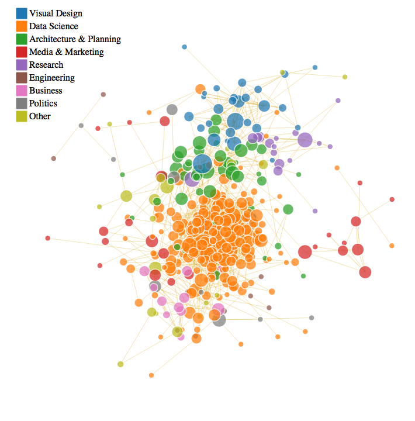

<!-- README.md is generated from README.Rmd. Please edit that file -->
Visualize Your LinkedIn Network
===============================

This repository is a tutorial demonstrating how to use your LinkedIn data to visualize your professional-social network in R and D3.JS.

1. Install and Load Libraries
-----------------------------

``` r

library("networkD3")
library("rjson")
library("jsonlite")
library("igraph") 
```

2. Read in your LinkedIn Data
-----------------------------

``` r
l <- fromJSON("https://raw.githubusercontent.com/michaeljules/social-network-viz/master/data/data.js",flatten=TRUE)
```

3. Translate Data to Adjacency Matrix then Network Object
---------------------------------------------------------

``` r
networkData <- l$reducedMatrix
rownames(networkData) <- paste0(l$publicConnections$firstName[1:499]," ",l$publicConnections$lastName[1:499])
colnames(networkData) <- rownames(networkData) 

g <- graph.adjacency(networkData,mode="undirected")
```

4. Add Node Attributes to the Network:
--------------------------------------

``` r
V(g)$industry <- l$publicConnections$industry[1:499]
V(g)$location <- l$publicConnections$location.name[1:499]
V(g)$names <- paste0(l$publicConnections$firstName[1:499]," ",l$publicConnections$lastName[1:499])
V(g)$click <- l$publicConnections$pictureUrl[1:499]
V(g)$country <- l$publicConnections$location.country.code[1:499]
V(g)$headline <- l$publicConnections$headline[1:499]
```

5. Calculate Network Centrality Scores For Each Node
----------------------------------------------------

``` r
b <- betweenness(g, v=V(g), directed = FALSE, weights = NULL,
                 nobigint = TRUE, normalized = FALSE)
# Take the Square Root of the betweenness measure so nodes are not too large
V(g)$betweenness <- sqrt(b)
```

6. Remove Isolates From Network
-------------------------------

``` r
#identify isolated nodes
bad.vs <- V(g)[degree(g) == 0] 

# remove isolated nodes
g <- delete.vertices(g, bad.vs)
```

7. Identify Network Communities
-------------------------------

``` r
c3 <- cluster_label_prop(g)
# Note: cluster_label_prop is a fast, nearly linear time algorithm for detecting community structure in networks. In works by labeling the vertices with unique labels and then updating the labels by majority voting in the neighborhood of the vertex.

# Assign community membership to network nodes
V(g)$c3 <- c3$membership

# Label Group Memberships -- These are self-identified network communites based on the function above.
c3$group <- c3$membership
c3$group[c3$membership==1] <- "Visual Design"
c3$group[c3$membership==2] <- "Data Science"
c3$group[c3$membership==3] <- "Architecture & Planning"
c3$group[c3$membership==4] <- "Media & Marketing"
c3$group[c3$membership==5] <- "Media & Marketing"
c3$group[c3$membership==6] <- "Research"
c3$group[c3$membership==7] <- "Engineering"
c3$group[c3$membership==8] <- "Media & Marketing"
c3$group[c3$membership==9] <- "Business"
c3$group[c3$membership==10] <- "Politics"
c3$group[c3$membership==11] <- "Media & Marketing"
c3$group[c3$membership==12] <- "Data Science"
c3$group[c3$membership==13] <- "Data Science"
c3$group[c3$membership==14] <- "Other"
c3$group[c3$membership==15] <- "Other"
c3$group[c3$membership==16] <- "Other"
c3$group[c3$membership==17] <- "Data Science"
c3$group[c3$membership==18] <- "Other"
c3$group[c3$membership==19] <- "Engineering"
c3$group[c3$membership==20] <- "Politics"
c3$group[c3$membership==21] <- "Media & Marketing"
c3$group[c3$membership==22] <- "Other"
c3$group[c3$membership==23] <- "Other"

# Assign Community Membership to Network Nodes
V(g)$c3 <- c3$group
```

8. Translate Network Graph to D3
--------------------------------

``` r
library(networkD3)

g_d3 <- igraph_to_networkD3(g)

## Append Node Attributes
g_d3$nodes$location <- V(g)$location
g_d3$nodes$industry <- V(g)$industry
g_d3$nodes$click    <- V(g)$click
g_d3$nodes$betweenness  <- V(g)$betweenness
g_d3$nodes$country <- V(g)$country
g_d3$nodes$position <- V(g)$position
g_d3$nodes$group <- V(g)$neighborhood
g_d3$nodes$headline <- V(g)$headline
g_d3$nodes$cle <- V(g)$cle
g_d3$nodes$c3 <- V(g)$c3

net <- forceNetwork(Links=g_d3$links,
             Nodes=g_d3$nodes,
             width=700,
             height=700,
             NodeID = 'headline', 
             Group  = 'c3',
             radiusCalculation = JS("Math.sqrt(d.nodesize)+5"),
             Nodesize = 'betweenness',
             charge = -30,
             linkWidth = .4,
             colourScale = JS("d3.scale.category10()"),
             linkColour = "goldenrod",
             zoom = FALSE,
             legend = TRUE,
             opacity = .85,
             opacityNoHover = 0,
             bounded = FALSE,
             fontFamily = "San Francisco",
             fontSize = 14) 
```

9. Example: My LinkedIn Network
-------------------------------



10. Concluding
--------------

I hope you found this exercise useful. You can contact me at michael\[at\]beautifuldataviz.com for any questions or suggestions you might have, or to report any bugs in the code.
